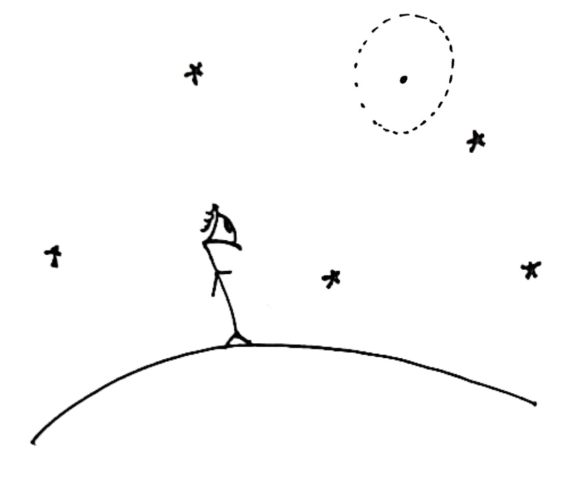

# MyPhD 

:notebook_with_decorative_cover: My PhD thesis (to be uploaded after the defense which is scheduled for March 17) and auxiliary notebooks.

  <h2 align="center">Probing thermal effects on static spacetimes   with Unruh-DeWitt detectors</h2>
  

#### :open_file_folder: Contents of the notebooks here

1. [on_squeezing_into_a_tiny_black_hole.nb](on_squeezing_into_a_tiny_black_hole.nb): explanation of the first sentence of my thesis (the one right after the title "Introduction": "—If we squeezed ourselves into grains of sand,\[...\]").

2. [CurvatureData.nb](CurvatureData.nb): 
  - Killing equations of Examples 1.2 and 1.8
  - Surface gravity as per Equation 1.5.2 from from Equation 1.3.2
  - Curvature tensors of the Examples of Section 1.5

3. [KG_equation_in_Schd_like_coordinates.nb](KG_equation_in_Schd_like_coordinates.nb): how to obtain Equation (2.2.7) from the Klein-Gordon Equation (2.1.1).

#### :bar_chart: Obs
The numerical analysis of the results in the Applications chapter are in separate repositories, as referenced in the papers. 

#### :heavy_exclamation_mark: Erratum
The original version of my thesis, the one that I submitted for evaluation, can be found in [coming_up_soon](coming_up_soon). The version here is an updated version, where I have corrected the following: 

- misplaced parenthesis in Equations 3.3.10 and 3.3.11.
